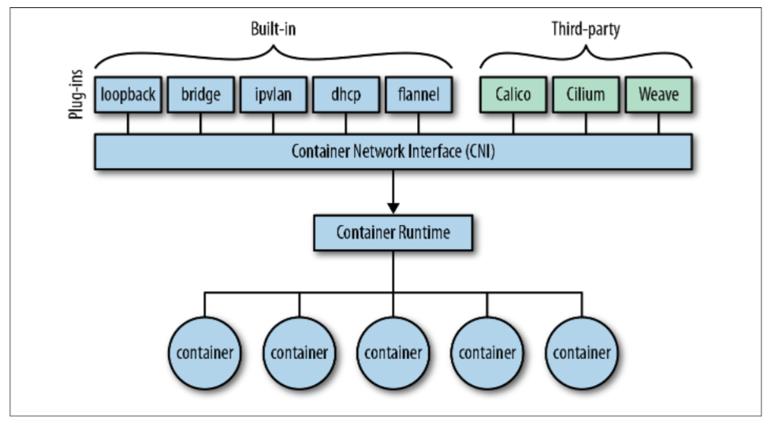

# 6. CNI(容器网络接口)

&emsp;&emsp;如图6-1所示，[容器网络接口（CNI）](https://github.com/containernetworking/cni)为容器和容器编排系统提供了一个面向插件的网络解决方案。它由用于编写插件的规范和在Linux容器中配置网络接口的库组成。

&emsp;&emsp;CNI规范是轻量级的; 它只规范了容器网络的连接，以及容器被删除时网络资源的回收。

&emsp;&emsp;在本书中，我们将重点介绍CNI，因为它是容器编排系统网络解决方案的事实标准，被所有主流编排系统（如Kubernetes，Mesos和Cloud Foundry）采用。如果您专门使用Docker Swarm，则需要使用Docker的libnetwork，并且可能需要阅读Lee Calcoted的题为“[The Container Networking Landscape: CNI from CoreOS and CNM from Docker](https://thenewstack.io/container-networking-landscape-cni-coreos-cnm-docker/)”的文章，该文章对比了CNI和Docker网络模型，并为您提供了一些指导。