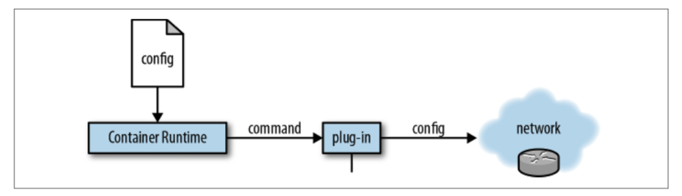

# 6.2 规范和使用

&emsp;&emsp;CNI除了CNI规范之外，在编写[0.3.1-dev版本](https://github.com/containernetworking/cni/blob/spec-v0.3.1/SPEC.md)时，CNI的[Github仓库](https://github.com/containernetworking/cni)还包含了用于将CNI集成到应用程序中的Go源代码库以及用于调试CNI插件的命令行工具。CNI的[插件仓库](https://github.com/containernetworking/plugins)还包含了编写插件的事例和用于创建新插件的模板。

&emsp;&emsp;在我们深入CNI的使用之前，让我们看看CNI中的两个重要的概念：

- 容器

    与Linux的网络命名空间同义。它对应的单元取决于容器运行时的具体实现（单个容器或pod）。

- 网络

    一组可独立寻址的实体，可以相互通信。这些实体可能是单独的容器，主机或其他网络设备，如路由器。

&emsp;&emsp;从宏观上，我们来看看CNI是如何工作的，如图6-2所示。首先，容器运行时需要一些配置并向插件发出命令。插件被调用并配置网络。



因此，CNI在概念上允许您做的是将容器添加到一个网络或者将其从一个网络中删除。CNI的当前版本定义了以下操作：

- 将容器添加到一个或多个网络

- 从网络中删除容器

- 报告CNI版本

&emsp;&emsp;为了使CNI插件能够向网络中添加容器，容器运行时必须首先为该容器创建一个新的网络命名空间，然后调用一个或多个定义的插件。网络配置采用JSON格式，并包含必要的字段，如名称和类型以及特定插件的特定字段。实际的命令（例如，ADD）作为一个名为CNI_COMMAND的环境变量传入。

*CNI插件需要为网络接口分配IP地址并设置与其相关的网络路由。这给CNI插件带来了很大的灵活性，但也给它带来了很大的负担。为了适应这种情况，CNI定义了专门负责IP地址管理的插件（IPAM）*

&emsp;&emsp;让我们来看看一个具体的CNI命令：

```bash
    $ CNI_COMMAND=ADD \
      CNI_CONTAINERID=875410a4c38d7 \
      CNI_NETNS=/proc/1234/ns/net \
      CNI_IFNAME=eth0 \
      CNI_PATH=/opt/cni/bin \
      someplugin < /etc/cni/net.d/someplugin.conf
```

&emsp;&emsp;此示例显示了如何使用特定配置（someplugin.conf）将某个插件（someplugin）应用于给定容器（875410a4c38d7）。请注意，虽然最初所有配置参数都作为环境变量传入，但现在更多的是使用（JSON）配置文件。

&emsp;&emsp;您可以在Jon Langemak的博客文章中“[Understanding CNI](http://www.dasblinkenlichten.com/understanding-cni-container-networking-interface/)”中了解更多关于使用CNI的知识。