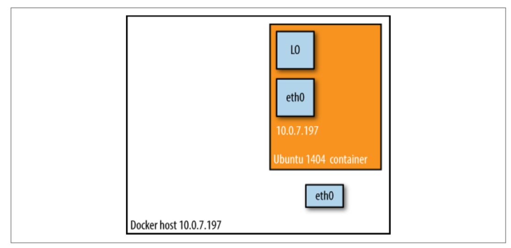

# 2.2 Docker网络模型

Docker提供了四种单主机联网模式：

- 桥接（bridge）模式

    &emsp;&emsp;通常用于在独立容器中运行的应用程序，这是默认的Docker网络模型。

- 主机（Host）模式

    &emsp;&emsp;也用于独立容器，共享主机的网络。

- 容器模式

    &emsp;&emsp;让您重用另一个容器的网络命名空间。Kubernetes中pod内容器就是使用此种模式。

- none网络

    &emsp;&emsp;禁用Docker端的网络支持，并允许您设置自定义网络。

&emsp;&emsp;现在我们将仔细研究这四种网络模式，并在本章结尾部分介绍一些网络管理方面的注意事项，包括IP/端口管理和安全性。

## 桥接网络模式

&emsp;&emsp;在这种模式下（参见图2-2），Docker守护进程创建了docker0，它是一个虚拟以太网网桥，它可以在连接到它的任何port之间自动转发数据包。 默认情况下，守护进程会通过创建一对对等的网络接口将主机上的所有容器连接到此网桥，将其中一个对等端分配为容器的eth0接口，并将另一个对等端放在主机的命名空间中；以及将专用IP范围内的一个子网分配给网桥。以下是使用桥接模式的示例：

```bash
$ docker run -d -P --net=bridge nginx:1.9.1
$ docker ps
CONTAINER ID
STATUS
17d447b7425d
Up 18 seconds  0.0.0.0:49153->443/tcp,
IMAGE                  COMMAND    CREATED
PORTS                  NAMES
nginx:1.9.1            nginx -g   19 seconds ago
                   0.0.0.0:49154->80/tcp  trusting_feynman
```

***注意***：因为桥接模式是Docker的默认设置，所以你可以在上一个命令中使用`docker run -d -P nginx：1.9.1`。如果您不使用-P参数或`-p <host_port>：<container_port>`，则IP数据包将不可路由到本主机之外的其他容器。


## 主机网络模式

&emsp;&emsp;该模式有效地禁用了Docker容器的网络隔离特性。由于容器共享主机的网络命名空间，因此如果主机网络没有受到防火墙限制，它可能会直接暴露给公共网络。此外作为共享主机网络命名空间的后果，您需要以某种方式管理端口的分配。以下是主机网络模式的实例：

```bash
$ docker run -d --net=host ubuntu:14.04 tail -f /dev/null
$ ip addr | grep -A 2 eth0:
    2: eth0: <BROADCAST,MULTICAST,UP,LOWER_UP> mtu 9001 qdisc mq state UP group
    default qlen 1000
        link/ether 06:58:2b:07:d5:f3 brd ff:ff:ff:ff:ff:ff
        inet **10.0.7.197**/22 brd 10.0.7.255 scope global dynamic eth0
$ docker ps
CONTAINER ID  IMAGE         COMMAND  CREATED
  STATUS        PORTS         NAMES
    b44d7d5d3903  ubuntu:14.04  tail -f  2 seconds ago
    Up 2 seconds                jovial_blackwell
    $ docker exec -it b44d7d5d3903 ip addr
    2: eth0: <BROADCAST,MULTICAST,UP,LOWER_UP> mtu 9001 qdisc mq state UP group
    default qlen 1000
        link/ether 06:58:2b:07:d5:f3 brd ff:ff:ff:ff:ff:ff
        inet **10.0.7.197**/22 brd 10.0.7.255 scope global dynamic eth0

// 我们可以看到容器具有与主机相同的IP地址，即10.0.7.197
```

&emsp;&emsp;在图2-3中我们看到，当使用主机网络模式时，容器有效地继承了主机的IP地址。这种模式比桥接模式更快，因为没有路由开销，但它将容器直接暴露给公共网络，并会带来所有安全隐患。



## 容器网络模式

&emsp;&emsp;在这种模式下，您告诉Docker重用另一个容器的网络命名空间。一般来说，如果您想对网络栈进行细粒度的控制，此模式非常有用。 实际上，Kubernetes网络使用这种模式，您可以在第7章中阅读更多关于它的内容。

```bash
$ docker run -d -P --net=bridge nginx:1.9.1
$ docker ps
    CONTAINER ID  IMAGE        COMMAND   CREATED         STATUS
    PORTS                      NAMES
    eb19088be8a0  nginx:1.9.1  nginx -g  3 minutes ago   Up 3 minutes
    0.0.0.0:32769->80/tcp,
    0.0.0.0:32768->443/tcp     admiring_engelbart
$ docker exec -it admiring_engelbart ip addr
    8: eth0@if9: <BROADCAST,MULTICAST,UP,LOWER_UP> mtu 9001 qdisc noqueue state
    UP group default
        link/ether 02:42:ac:11:00:03 brd ff:ff:ff:ff:ff:ff
        inet **172.17.0.3**/16 scope global eth0
$ docker run -it --net=container:admiring_engelbart ubuntu:14.04 ip addr
    ...
    8: eth0@if9: <BROADCAST,MULTICAST,UP,LOWER_UP> mtu 9001 qdisc noqueue state
    UP group default
        link/ether 02:42:ac:11:00:03 brd ff:ff:ff:ff:ff:ff
        inet **172.17.0.3**/16 scope global eth0
```

&emsp;&emsp;这个例子中的结果正是我们所期望的：以--net=container创建的第二个容器与第一个容器（即172.17.0.3）具有相同的IP地址。

## none网络模式

&emsp;&emsp;该模式将容器放入容器自己的网络命名空间中，但未对其进行配置。实际上，这会关闭网络通信，对于两种情况非常有用：对于不需要网络的容器（如批量作业写入磁盘卷），或者要设置自定义网络（请参见第3章）。下面none网络模式的使用：

```bash
$ docker run -d -P --net=none nginx:1.9.1
$ docker ps
CONTAINER ID  IMAGE
STATUS        PORTS
d8c26d68037c  nginx:1.9.1
Up 2 minutes
COMMAND   CREATED
NAMES
nginx -g  2 minutes ago
grave_perlman
$  docker inspect d8c26d68037c | grep IPAddress
        "IPAddress": "",
        "SecondaryIPAddresses": null,
```

&emsp;&emsp;您可以阅读关于网络的更多信息，并通过[Docker文档](https://docs.docker.com/network/)了解配置选项。
