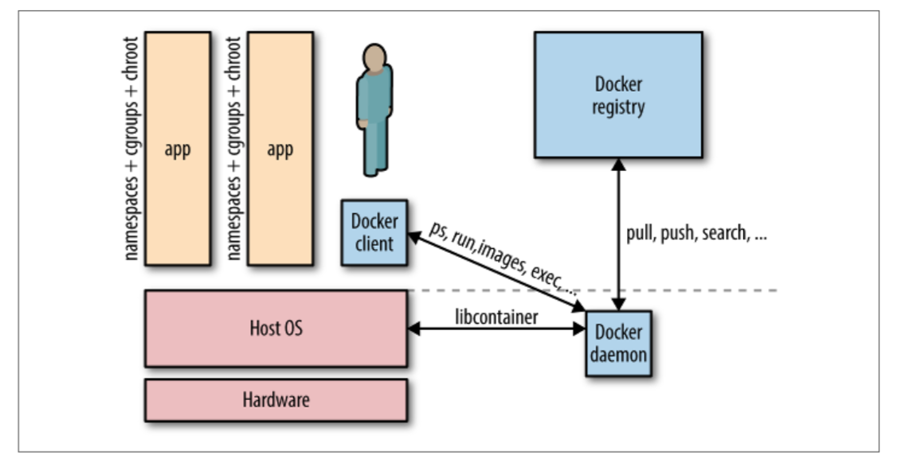

# 2.1 单主机容器网络101

&emsp;&emsp;容器需要在主机之上运行。 这可以是物理机，例如本地数据中心中的物理机，也可以是虚拟机，无论是在本地还是在云中。

&emsp;&emsp;对于Docker容器，主机有一个守护进程和一个客户端运行，如图2-1所示，您可以拉取/推送镜像，启动，停止，暂停和检查容器。 请注意，现在大多数（如果不是全部的话）容器都符合[Open Container Initiative（OCI）](https://www.opencontainers.org)标准，并且Docker还有一些有趣的替代品，尤其是在Kubernetes的CRI标准下（例如Kata，pouch）。

&emsp;&emsp;主机和容器之间的关系是1：N。 这意味着一台主机通常会运行多个容器。 例如，[Facebook报告](https://www.youtube.com/watch?v=C_WuUgTqgOc)说，依赖于机器的强健程度，平均每个主机运行10到40个容器。

&emsp;&emsp;无论您是单主机部署还是使用一组机器，您都可能需要处理一些网络问题：

- 对于单主机部署，您几乎总是需要连接到同一主机上的其他容器；例如，像WildFly这样的应用程序可能需要连接到数据库容器。

- 在多主机部署中，您需要考虑两个方面：同一个主机内容器间的通信以及跨主机容器间的通信。 性能考虑和安全方面都是您的设计方案需要考虑的。 无论是单个主机容量不足，或高可用的原因，还是希望使用分布式系统（如Apache Spark或Apache Kafka），多主机部署通常都是必需的。

***分布式系统和数据局部性：***

&emsp;&emsp;*使用分布式系统（用于计算或存储）的基本思想是受益于并行处理，通常与数据局部性相对应。就数据局部性而言，我的意思是将代码传送到数据所在的位置，而不是（传统的）其他方式。*

&emsp;&emsp;*此时你可以想一下：如果数据集大小在TB范围内，并且代码大小以MB为单位，那么在集群中移动代码比将所有数据传输到中央处理位置更有效。 除了能够并行处理事物之外，通常可以通过分布式系统获得容错能力，因为系统的某些部分可以或多或少独立地继续工作。*

&emsp;&emsp;简而言之，Docker网络是Docker原生提供的本地容器SDN解决方案。
