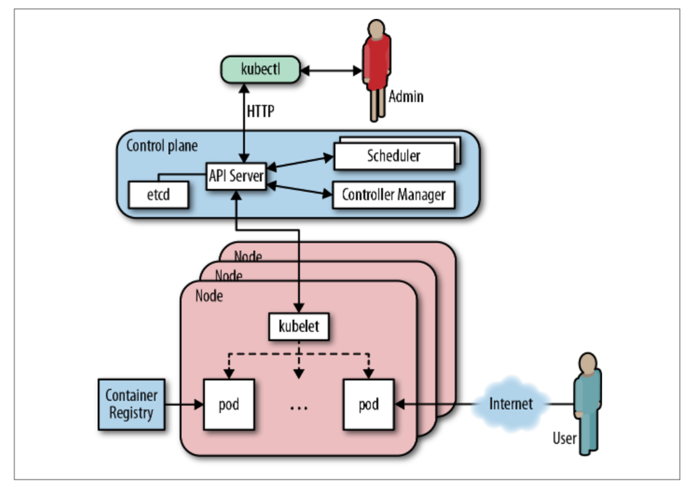

# 7.1 Kubernetes简介

&emsp;&emsp;Kubernetes是一款开源的容器编排系统。它源自谷歌内部的容器编排系统Borg所积累的十多年的经验。截至2018年初，Kubernetes被认为是容器编排领域事实上的行业标准，云原生领域的“Linux系统”。

&emsp;&emsp;*我认为有关Kubernetes的诞生至少有两个重要时刻。第一次是在2014年6月7日，Joe Beda在GitHub上的最初[commit](https://github.com/kubernetes/kubernetes/commit/2c4b3a562ce34cddc3f8218a2c4d11c7310e6d56)，它标志着项目开源的开始。第二个阶段是在一年后的2015年7月20日，当时谷歌推出了Kubernetes 1.0，并宣布组建一个专门的组织[云原生计算基金会（CNCF）](https://www.cncf.io)来主持和管理Kubernetes。我有幸参加了发布会，我可以告诉你，这无疑是庆祝项目诞生的一种方式。*

&emsp;&emsp;Kubernetes的体系结构（图7-1）为许多工作负载提供支持，使您可以运行无状态以及有状态的容器化应用程序。您也可以启动伺服性服务，例如低延迟应用程序以及批处理作业。

&emsp;&emsp;Kubernetes的调度单位是一个pod。本质上，这是一组紧密耦合的一个或多个容器，它们总是并置在一起（即作为一个单元安排在一个节点上）。可以通过replicas控制器声明式地声明和执行以pod副本为模板的多个实例。所有资源（如pods,deployments,或者services）的逻辑组织都是通过标签选择器进行的。

&emsp;&emsp;使用Kubernetes，您几乎总是可以选择使用某种开源或封闭源替代方法替换默认的实现，无论是DNS还是监控。Kubernetes具有高度的[可扩展性](https://kubernetes.io/docs/concepts/overview/extending/)，从定义新的工作负载和资源类型到定制面向用户的部分都是可以的。

&emsp;&emsp;本章假定您对Kubernetes及其术语有所了解。如果您需要了解关于Kubernetes如何运作的知识，我建议您查阅官方文档中的[Concepts部分](https://kubernetes.io/docs/concepts/)或Brendan Burns，Kelsey Hightower和Joe Beda撰写的[Kubernetes Up and Running（O'Reilly）](http://shop.oreilly.com/product/0636920043874.do)。