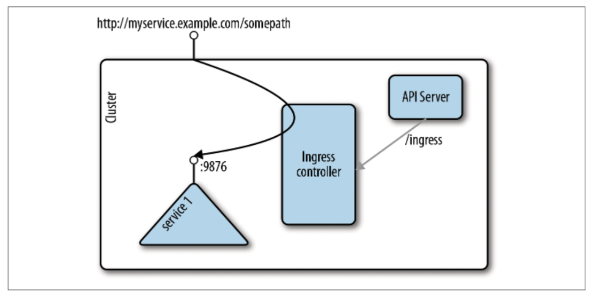

# 7.6 Ingress与Egress

&emsp;&emsp;下面我们将看看流量如何进出Kubernetes集群，也称为南北向流量。

## Ingress

&emsp;&emsp;到目前为止，我们已经讨论了如何从群集内访问一个pod或service。从群集外部访问pod更具挑战性。Kubernetes旨在为服务提供高可用性，高性能负载平衡。

&emsp;&emsp;最初，在Kubernetes中，南北向流量的唯一可用的方案是NodePort，现在LoadBalancer和ExternalName这些[方案](https://kubernetes.io/docs/concepts/services-networking/service/#publishing-services---service-types)也可供您使用。对于第7层流量（即HTTP），Ingress提供了更便携的方案，作为beta功能被引入Kubernetes 1.2，您可以使用Ingress将流量从外部世界路由到集群中的服务。

&emsp;&emsp;Kubernetes中的[Ingress](https://kubernetes.io/docs/concepts/services-networking/ingress/)的工作原理如图7-5所示：在概念上，它被分成两个主要部分，Ingress资源对象和一个Ingress控制器。Ingress资源对象定义了如何路由到后端service，Ingress控制器监听apiserver的/ingresses端点，了解正在创建或删除的service。一旦service的状态发送变化，Ingress控制器配置路由，以便外部流量落在集群内部的特定service。



&emsp;&emsp;以下示例展示了一个Ingress资源的具体示例，用于将myservice.example.com/somepath的请求路由到端口9876上名为service1的Kubernetes服务。

```yaml
apiVersion: extensions/v1beta1
kind: Ingress
metadata:
    name: example-ingress
spec:
    rules:
    - host: myservice.example.com
      http:
        paths:
        - path: /somepath
          backend:
            serviceName: service1
            servicePort: 9876
```

&emsp;&emsp;现在，Ingress资源定义好了，但是没有Ingress控制器，是没有任何反应的 所以让我们部署一个Ingress控制器，这里我们使用Minikube。

```bash
$ minikube addons enable ingress
```

&emsp;&emsp;一旦您在Minikube上启用了Ingress，您应该会看到它在Minikube的附加组件列表中显示为已启用。一分钟左右后，两个新的pod将创建在kube-system namespace下。你现在可以使用ingress了，我们使用下面的yaml文件，它配置了一个NGINX web服务的路径。

```yaml
$ cat nginx-ingress.yaml
kind: Ingress
apiVersion: extensions/v1beta1
metadata:
    name: nginx-public
annotations:
    ingress.kubernetes.io/rewrite-target: /
spec: 
    rules:
    - host:
      http:
        paths:
        - path: /web
          backend:
            serviceName: nginx
            servicePort: 80
$ kubectl create -f nginx-ingress.yaml
```

&emsp;&emsp;现在NGINX通过IP地址192.168.99.100（这是我的Minikube IP）可用，yaml定义了它应该通过/web路径显示。

&emsp;&emsp;请注意，Ingress控制器在技术上可以是任何能够进行反向代理的工具，但NGINX是最常用的。此外，Ingress还可以通过云厂商的负载均衡器（如亚马逊的[ALB](https://docs.aws.amazon.com/elasticloadbalancing/latest/application/introduction.html)）实施。

&emsp;&emsp;有关Ingress的更多详细信息，请阅读Mark Betz的文章“[Understanding Kubernetes Networking：Ingress](https://medium.com/google-cloud/understanding-kubernetes-networking-ingress-1bc341c84078)”，也可以查看[Kubernetes SIG Network针对此主题进行的调查结果](https://github.com/bowei/k8s-ingress-survey-2018)。

## Egress

&emsp;&emsp;在Ingress的情况下，我们将流量从集群外部路由到集群内的服务，在Egress的情况下，我们处理相反情况：pod中的应用如何调用集群外部API？

&emsp;&emsp;人们可能想要控制允许哪个pod与外部服务之间可以通信，并且最重要的是实施网络策略。请注意，默认情况下，pod中的所有容器都可以执行egress流量。这些网络策略可以使用Kubernetes中的networkpolicy进行实施，也可以通过部署服务网格（service mesh）来实施。