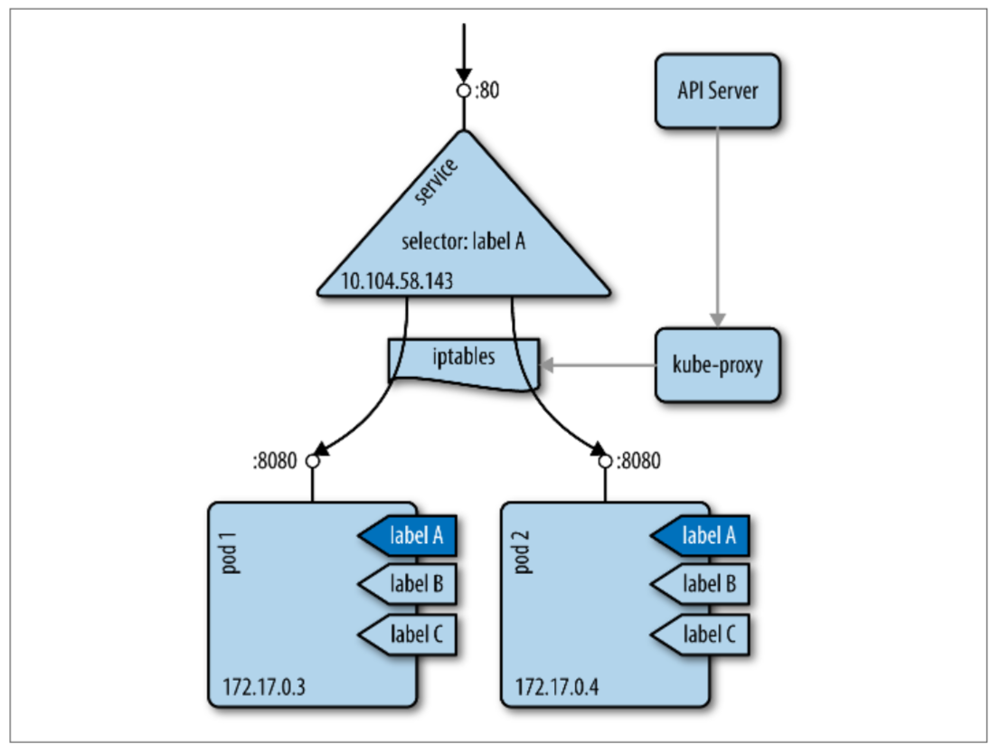
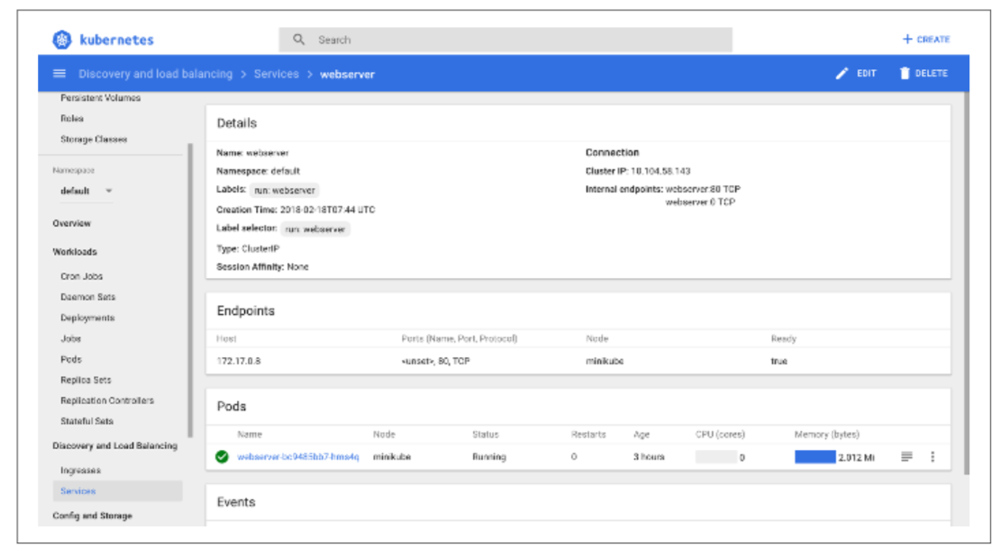

# 7.4 Pod间网络

&emsp;&emsp;在Kubernetes中，每个pod具有可路由的IP，允许pod跨集群节点进行通信而无需NAT，也无需管理端口分配。由于每个pod都获得真实的IP地址，因此pod间可以在不使用代理或转换（例如NAT）的情况下进行通信。pod可以使用端口通信，也可以不使用更高级的服务发现机制进行通信。

&emsp;&emsp;我们将pod间（也称为东西向流量）的通信分为两类：

- pod可以直接与其他pod进行通信; 在这种情况下，请求通信的pod需要知道被请求pod的IP地址，并且有可能会重复此操作，因为”牲畜模式“。

- 普遍地，pod通过service与其他pod进行通信。在这种情况下，该service提供了一个可以通过DNS发现的稳定的，虚拟IP地址。

&emsp;&emsp;当一个容器试图获取网络接口的地址时，它看到的IP是与pod中任何其他容器看到的是同一个IP; 每个pod都有一个其他pod可以找到和使用的IP地址。通过使IP地址和端口在Pod内外相同，Kubernetes在整个集群中创建了一个编排的地址空间。有关此主题的更多详细信息，另请参阅Mark Betz撰写的文章“[Understanding Kubernetes Networking: Pods](https://medium.com/google-cloud/understanding-kubernetes-networking-pods-7117dd28727)”。

&emsp;&emsp;现在我们来看看[service](https://kubernetes.io/docs/concepts/services-networking/service/)，如图7-3所示。



&emsp;&emsp;service为一组pod提供稳定的虚拟IP（VIP）地址。虽然Pod是经常变化的（扩容，缩容等），但service允许客户端通过使用VIP可靠地发现并连接到在Pod中正在运行的容器。VIP中的“虚拟”意味着它不是连接到网络接口的实际IP地址; 它的目的纯粹是充当稳定的”前端“，将流量转发到一个或多个Pod，因为service后端的pod的IP地址可能会不断变化。

&emsp;&emsp;必须认识到VIP在网络堆栈中不存在的。例如，你不能ping它们。他们只是Kubernetes内部管理的实体。还要注意它的格式是IP:PORT，所以IP地址和端口一起构成了VIP。可以把VIP视为一种映射到实际IP地址的数据结构的索引。

&emsp;&emsp;如图7-3所示，使用VIP 10.104.58.143的服务将流量路由到其中一个容器172.17.0.3或172.17.0.4。这里需要注意的是service和pod的属于不同的子网，现在，你可能想知道这实际上是如何工作的？

&emsp;&emsp;您可以通过标签选择器指定service后端的一组pod，例如，spec.selector.app = someapp Kubernetes将创建一个service，该service的目标是带有标签app = someapp的所有pod。请注意，如果存在这样的选择器，那么对于每个目标Pod将创建一个Endpoint类型的子资源，并且如果不存在标签选择器，则不会创建Endpoint。例如，请参阅以下代码示例kubectl describe命令的输出。这种Endpoint也不是在所谓的[Headless的service](https://kubernetes.io/docs/concepts/services-networking/service/#headless-services)的情况下创建的，它允许您对IP管理和服务发现的发生进行很好的控制。

&emsp;&emsp;保持最新的VIP和pod之间的映射是kube-proxy的工作（另请参阅[kube-proxy文档](https://kubernetes.io/docs/reference/command-line-tools-reference/kube-proxy/)），这是一个在kubernetes集群中的每个node节点上运行的进程。

&emsp;&emsp;kube-proxy进程查询apiserver以了解群集中新的service，并相应地更新节点的iptables规则，以提供必要的路由信息。要了解更多service如何工作，请查看[Kubernetes Services By Example](https://blog.openshift.com/kubernetes-services-by-example/)。

&emsp;&emsp;让我们动手看看service是如何工作的：假设有一个名为webserver的deployment（例如，执行kubectl run webserver --image nginx），您可以自动创建一个服务，如下所示：

```bash
$ kubectl expose deployment/webserver --port 80
service "webserver" exposed
$ kubectl describe service/webserver
Name:               webserver
Namespace:          default
Labels:             run=webserver
Annotations:        <none>
Selector:           run=webserver
Type:               ClusterIP
IP:                 10.104.58.143
Port:               <unset>  80/TCP
TargetPort:         80/TCP
Endpoints:          172.17.0.3:8080,172.17.0.4:8080
Session Affinity:   None
Events:             <none>

$ kubectl get service -l run=webserver
NAME        TYPE        CLUSTER-IP      EXTERNAL-IP   PORT(S)   AGE
webserver   ClusterIP   10.104.58.143   <none>        80/TCP    1m
```

&emsp;&emsp;我们可以看到service已经拥有了一个集群内部的IP（10.104.58.143），EXTERNAL-IP列告诉你这个服务只能在集群内部使用，也就是说，没有来自群集外部的流量可以访问此service。

&emsp;&emsp;在图7-4中，您可以在Kubernetes仪表板中看到该service。

