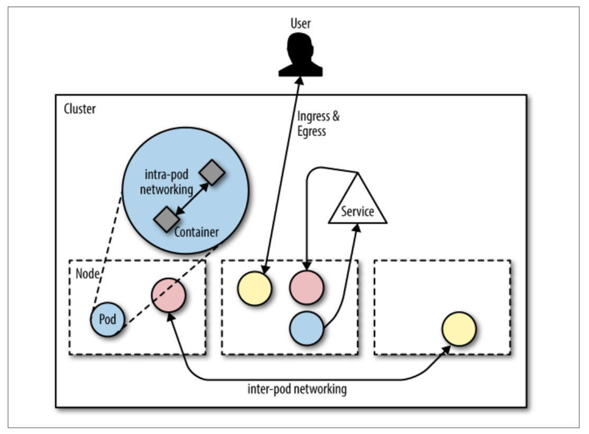

# 7.2 Kubernetes网络概述

&emsp;&emsp;Kubernetes并没有规定一定使用某种网络解决方案，而只是陈述了三个基本[要求](https://kubernetes.io/docs/concepts/cluster-administration/networking/#kubernetes-model)：

- pod可以与所有其他pod通信而无需NAT。
- 节点可以与所有pod进行通信（反之亦然）,无需NAT。
- 容器看到的自己的IP与其他容器看到的IP相同。

&emsp;&emsp;您如何满足这些要求取决于您。这意味着你有很多自由空间来实现Kubernetes的网络。然而，这也意味着Kubernetes本身只会提供这么多; 例如，它支持CNI（第6章），但它没有提供默认的SDN解决方案。

&emsp;&emsp;从网络流量角度来看，我们在Kubernet中区分了三种类型，如图7-2所示：

- pod内网络

    一个pod中的所有容器共享一个网络命名空间，通过localhost彼此可见。

- pod间网络

    支持两种类型的东西向流量：Pod可以直接与其他Pod进行通信，或者，最好是Pod可以通过service与其他Pod进行通信。

- Ingress和Egress

    Ingress是指将来自外部用户或应用的流量路由到pod，egress指的是从pod调用外部API。

&emsp;&emsp;Kubernetes要求每个pod在一个扁平的网络中且都有一个IP，并与整个网络中的其他节点和pod完全连接。在上下文命名，服务发现或端口分配，这种IP-per-pod模型为您提供了一种向后兼容的方式，使您可以将Pod与虚拟机或物理主机几乎完全相同对待。该模型允许从非云原生应用程序和环境更平滑地过渡到Kubernetes环境。
