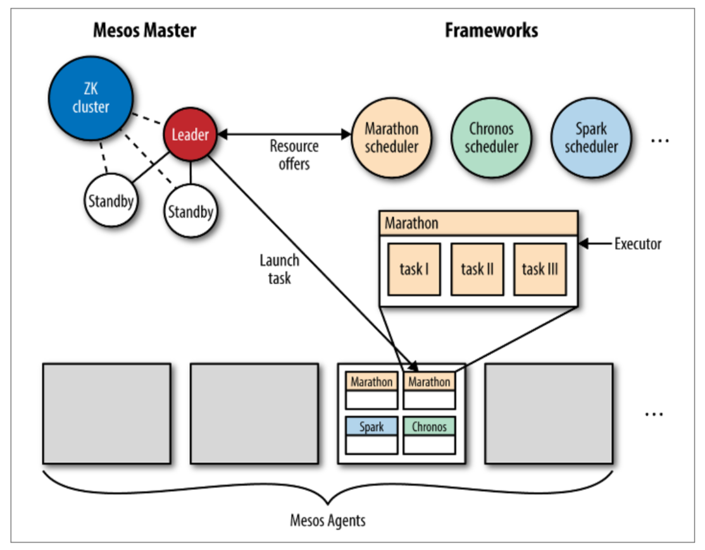

# 4.3 Apache Mesos

&emsp;&emsp;[Apache Mesos](http://mesos.apache.org)（图4-4）是一个通用的集群资源管理器，对于开发人员来说就像是抽象出来的一台巨大的计算机资源。 从某种意义上讲，Mesos就像是分布式操作系统的核心。因此，它永远不会被单独使用，而是总是与所谓的框架一起使用，例如Marathon（用于Web服务器等长时后台运行服务）或Chronos（用于批处理作业），或者大数据和快速数据框架（如Apache Spark或 Apache Cassandra）。



&emsp;&emsp;Mesos支持容器化的工作负载（即运行Docker容器）和简单的可执行文件（例如，用于无状态和有状态服务的bash脚本或Linux ELF格式的二进制文件）。

&emsp;&emsp;在下面的讨论中，我假设您熟悉Mesos及其相关术语。如果您是Mesos新手，我建议您阅读David Greenberg的图书[Building Applications on Mesos（O'Reilly）](http://shop.oreilly.com/product/0636920039952.do)，它作为分布式应用程序开发人员的入门介绍特别有用。

&emsp;&emsp;Mesos网络的特点和能力主要取决于您所使用的Mesos容器：

- 对于Mesos容器，有一些先决条件，比如需要使用Linux内核大于3.16的版本和并且安装了libnl。然后，您可以构建启用了网络隔离器的Mesos agent。在启动时，您可以使用类似下面的命令：

```bash
$mesos-slave --containerizer=mesos
         --isolation=network/port_mapping
         --resources=ports:[31000-32000];ephemeral_ports:[33000-35000]
```

上面这条命令将配置Mesos agent使用范围从31,000到32,000的非临时端口和从33,000到35,000范围内的临时端口。所有容器共享主机的IP，并且端口范围分布在这些容器上（目标端口和容器ID之间1：1的映射）。通过网络隔离器，您还可以进行性能限制，比如带宽限制；并且可以对每个容器执行网络流量的监控。参见Jie Yu在MesosCon 2015上的演讲“[Mesos中的每个容器网络监控和隔离](https://www.youtube.com/watch?v=ZA96g1M4v8Y)”了解更多关于这方面的内容。

- 对于Docker容器，请参阅[第2章](../introduction/index.md)。

&emsp;&emsp;请注意，自0.23版开始，Mesos支持[IP-per-container](https://mesosphere.com/blog/ip-per-container-mesos/)。如果您想了解更多关于Mesos网络的信息，请查看MesosCon 2015上Christos Kozyrakis和Spike Curtis关于“[Mesos Networking](https://events.static.linuxfound.org/sites/events/files/slides/mesos-networking.mesoscon2015.pdf)”的演讲。

&emsp;&emsp;尽管服务发现不是Mesos的主要功能，但实际中经常使用Mesos特定的解决方案：Mesos-DNS（详见服务发现章节），同时还有许多新兴的解决方案，比如traefik（详见服务发现章节）。

&emsp;&emsp;*由于Mesos-DNS是Mesos推荐的默认服务发现机制，因此关注Mesos-DNS如何[表示任务](http://mesosphere.github.io/mesos-dns/docs/naming.html)是很重要的。例如，正在运行的任务可能具有（逻辑）服务名称webserver.marathon.mesos，您可以通过DNS SRV记录找到分配的端口。*

&emsp;&emsp;如果您想免费在线试用Mesos，可以使用Katacoda上的“[将容器部署到DC/OS](https://katacoda.com/courses/dcos/getting-started)”在线环境。