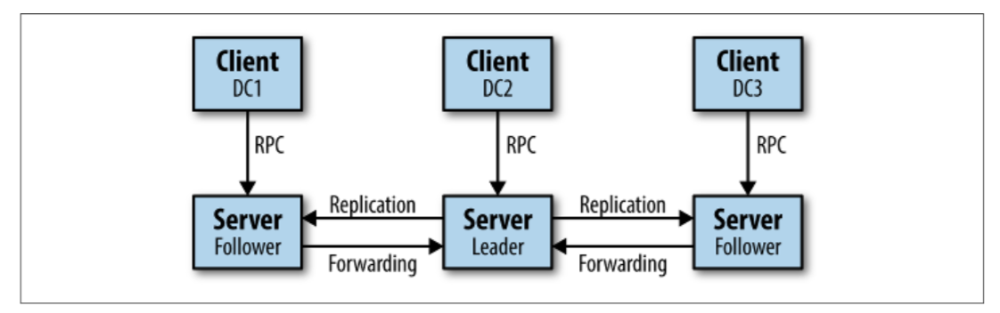

# 4.4 Hashicorp Nomad

&emsp;&emsp;[Nomad](https://www.nomadproject.io)是研发Vagrant的HashiCorp公司所研发的集群调度工具。它于[2015年9月推出](https://news.ycombinator.com/item?id=10291777)，主要关注简单易用。据报道，其[scheduler](https://www.nomadproject.io/docs/internals/scheduling.html)的设计灵感来自谷歌的omega，它借鉴了诸如具有集群的全局状态以及采用乐观的并发调度等概念。

&emsp;&emsp;Nomad拥有一个基于代理的[架构](https://www.nomadproject.io/docs/internals/architecture.html)，具有一个可以承担不同角色的单一二进制文件，支持滚动升级以及驱逐节点进而重新调度等功能。Nomad对所有状态复制和调度都使用一致性协议，并使用gossip协议来管理服务器的地址以实现群集自治和多区域联合。 如图4-5中，您可以看到Nomad的架构：

- server端负责接受来自用户的作业，管理客户端和计算任务的调度。

- 客户端（每个VM实例一个客户端）负责与作业中的任务或应用程序进行交互。他们以pull的方式工作; 也就是说，他们在服务器上注册，然后他们定期轮询它以观察待处理的工作。

&emsp;&emsp;Nomad中的[作业](https://www.nomadproject.io/docs/job-specification/index.html)采用名为HCL的HashiCorp专有格式或JSON定义，Nomad提供命令行界面以及HTTP API与服务器进程进行交互。Nomad将基础设施抽象为区域和数据中心。区域可能包含多个数据中心，具体取决于您在何种规模上运行。您可以将AWS，Azure或Google Cloud中的zone（比如us-central1-b）看作数据中心，region看做区域（比如us-central1）。

&emsp;&emsp;我假定您熟悉Nomad及其术语。如果不是的话，我建议你看看“[Nomad：一种分布式，乐观并发的调度器：Armon Dadgar，HashiCorp](https://www.youtube.com/watch?v=YTmtBi3uNVU)”，它是对Nomad的一个很好的介绍，以及[Nomad官方文档](https://www.nomadproject.io/docs/)。

&emsp;&emsp;要尝试下Nomad，可以使用HashiCorp的[UI演示](https://demo.nomadproject.io/ui/jobs)或者使用Katacoda上的“[Nomad介绍](https://katacoda.com/hashicorp/scenarios/nomad-introduction)”免费的在线环境。

&emsp;&emsp;Nomad配备了几个所谓的任务驱动程序, 从通用执行程序到java, 再到qemu，最后到docker。对于Nomad所要求的[docker驱动程序](https://www.nomadproject.io/docs/drivers/docker.html)，在撰写本文时，Docker版本为1.10或更高版本中，使用端口绑定的方式来暴露Docker容器中服务。它为Docker提供了自动和手动端口映射方案。

&emsp;&emsp;有关网络功能的更多详细信息，例如映射端口和标签的使用，请参阅[文档](https://www.nomadproject.io/docs/jobspec/networking.html)。

&emsp;&emsp;在[v0.2](http://blog.xebia.com/scheduling-containers-and-more-with-nomad/)版本中，Nomad引入了基于Consul的服务发现机制（详见服务发现章节）。它包括健康检查，并假定在Nomad内部运行的任务也需要能够连接到Consul代理，Consul代理对使用桥接网络模式的容器环境提出了挑战。