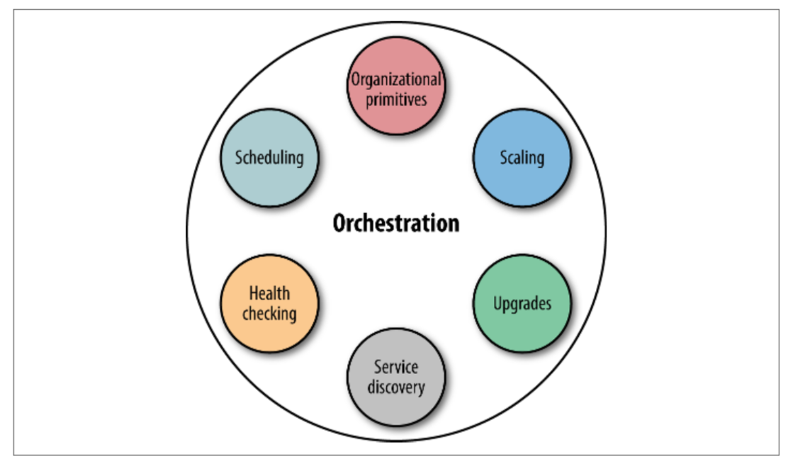

# 4. 编排

&emsp;&emsp;利用“牲畜模式”来管理基础架构，您不需要手动分配某些机器来运行应用程序。相反，您将利用编排系统来管理容器的生命周期。在图4-1中，您可以看到容器业务流程包含一系列功能，包括但不限于：

- 组织原语：（如Kubernetes中的标签用于查询和分组容器）

- 调度容器以在合适的主机上运行。

- 自动健康检查：以确定容器是否存活，并准备好为流量提供服务并在必要时重新启动。

- 自动调节（根据利用率或更高级别的指标增加或减少容器数量）

- 升级策略，从滚动更新到更复杂的技术，如[A/B测试和金丝雀部署](http://blog.christianposta.com/deploy/blue-green-deployments-a-b-testing-and-canary-releases/)

- 服务发现，以确定具体提供本次服务的一个容器，通常也包括DNS的支持

&emsp;&emsp;配置升级功能（在节点上安装或升级本地操作系统或设置容器运行时）有时候被认为是编排的一部分，但不在本书的讨论范围之内。

&emsp;&emsp;服务发现（第5章详细介绍）和调度实际上是同一枚硬币的两面。调度程序决定容器在集群中的位置，并在`容器 - >位置`表单中为其他部分组件提供最新的映射关系。我们可以用各种方式表示映射，例如在etcd等分布式键值存储中，通过DNS或通过环境变量。

&emsp;&emsp;在本章中，我们将从以下容器编排解决方案的角度讨论网络和服务发现：Docker Swarm和swarm模式，Apache Mesos和HashiCorp Nomad。您的公司可能已经在使用这三种方案中的一个（我们将在第7章中详细介绍Kubernetes），因此，为了完整起见，这里还是值得探讨。尽管如此，截至2018年初，Kubernetes已经成为容器编排领域的事实标准。

&emsp;&emsp;*除了本章讨论的三种容器编排系统之外，还有其他（封闭源代码）解决方案可供您了解，其中包括Facebook的[Bistro](https://facebook.github.io/bistro/)，以及像[Amazon ECS](https://aws.amazon.com/cn/ecs/features/)之类的托管的解决方案。*
&emsp;&emsp;*如果您想更全面地探讨分布式系统调度方面的主题，我建议您阅读Google关于[Borg](https://research.google.com/pubs/pub43438.html)和[Omega](https://research.google.com/pubs/pub41684.html)的研究论文*

&emsp;&emsp;然而，在我们深入到容器编排系统之前，让我们回顾一下调度器（编排系统的核心组件）在集容器化工作负载的情况下实际是怎么执行调度的。