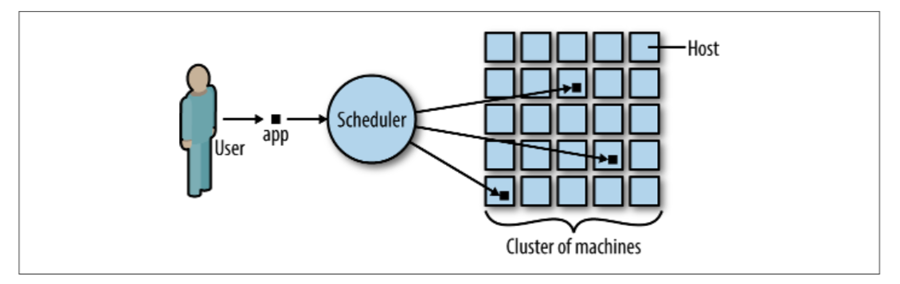

# 4.1 scheduler实际上是做什么的？

&emsp;&emsp;分布式系统的调度程序根据用户的请求应用容器调度到一台或多台可用的主机上。例如，用户可能请求运行100个应用程序实例，因此调度程序需要找到可用主机来运行这100个实例。

&emsp;&emsp;我们来看一个具体的例子。 在图4-2中，您可以看到用户请求在集群中运行三个应用程序实例。调度程序根据对集群状态的了解以决定容器实例的放置位置。群集状态可能包括机器的使用情况，成功启动应用程序所需的资源以及限制，例如仅在支持SSD的计算机上启动此应用程序。

&emsp;&emsp;此外，在进行调度时，服务质量有时候也需要考虑在内; 有关更多详细信息，请参阅Michael Gasch的文章“[QoS，节点可分配和Kubernetes调度程序](https://embano1.github.io/post/sched-reconcile/)”。

&emsp;&emsp;如果您想了解更多有关在分布式系统中进行调度的内容，我建议您查看John Wilkes的一篇文章“[Google集群管理](https://www.infoq.com/presentations/cluster-management-google)”。
