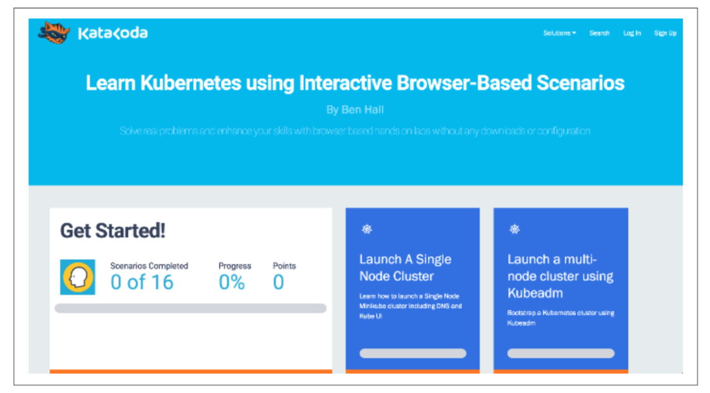

# 附录

&emsp;&emsp;深入了解一个领域，多阅读相关的资料是很好选择，在这里我已经汇集了一系列有关容器网络的资料链接，其中包含本书所涉及主题的深入分析等资料。但是，对于实操，我建议您查看Katacoda，这是一个免费的在线学习环境，其中包含从Docker到Kubernetes的100多种场景（请参阅图A-1中的屏幕截图）。

&emsp;&emsp;您可以在任何浏览器中使用Katacoda; 会话通常在一小时后会终止。

## 容器网络

### Networking 101

- “[Network Protocols](https://www.destroyallsoftware.com/compendium/network-protocols?share_key=97d3ba4c24d21147)” from the Programmer’s Compendium

- “[Demystifying Container Networking](https://blog.mbrt.it/2017-10-01-demystifying-container-networking/)” by Michele Bertasi

- “[An Empirical Study of Load Balancing Algorithms](http://liblb.com/learn.html)” by Khalid Lafi

### Linux Kernel and Low-Level Components

- “[The History of Containers](https://rhelblog.redhat.com/2015/08/28/the-history-of-containers/)” by thildred

- “[A History of Low-Level Linux Container Runtimes](https://opensource.com/article/18/1/history-low-level-container-runtimes)” by Daniel J. Walsh

- “[Networking in Containers and Container Clusters](http://wiki.iptables.org/pablo/netdev0.1/papers/Networking-in-Containers-and-Container-Clusters.pdf)” by Victor Marmol, Rohit Jnagal, and Tim Hockin

- “[Anatomy of a Container: Namespaces, cgroups & Some Filesystem Magic](https://www.slideshare.net/jpetazzo/anatomy-of-a-container-namespaces-cgroups-some-filesystem-magic-linuxcon)” by Jérôme Petazzoni

- “[Network Namespaces](https://lwn.net/Articles/219794/)” by corbet

- [Network classifier cgroup documentation](https://www.kernel.org/doc/Documentation/cgroup-v1/net_cls.txt)

- “[Exploring LXC Networking](http://containerops.org/2013/11/19/lxc-networking/)” by Milos Gajdos

### Docker

- [Docker networking overview](https://docs.docker.com/network/)

- “[Concerning Containers’ Connections: On Docker Networking](https://www.linuxjournal.com/content/concerning-containers-connections-docker-networking)” by Federico Kereki

- “[Unifying Docker Container and VM Networking](http://filipv.net/2015/11/06/unifying-docker-container-and-vm-networking/)” by Filip Verloy

- “[The Tale of Two Container Networking Standards: CNM v. CNI](http://www.nuagenetworks.net/blog/container-networking-standards/)” by Harmeet Sahni

## Kubernetes网络

### Kubernetes Proper and Docs

- [Kubernetes networking design](https://github.com/kubernetes/community/blob/master/contributors/design-proposals/network/networking.md)

- [Services](https://kubernetes.io/docs/concepts/services-networking/service/)

- [Ingress](https://kubernetes.io/docs/concepts/services-networking/ingress/)

- [Cluster Networking](https://kubernetes.io/docs/concepts/cluster-administration/networking/)

- [Provide Load-Balanced Access to an Application in a Cluster](https://kubernetes.io/docs/tasks/access-application-cluster/load-balance-access-application-cluster/)

- [Create an External Load Balancer](https://kubernetes.io/docs/tasks/access-application-cluster/create-external-load-balancer/)

- [Kubernetes DNS example](https://github.com/kubernetes/examples/blob/master/staging/cluster-dns/README.md)

- [Kubernetes issue 44063: Implement IPVS-based in-cluster service load balancing](https://github.com/kubernetes/kubernetes/issues/44063)

- “[Data and analysis of the Kubernetes Ingress survey 2018](https://github.com/bowei/k8s-ingress-survey-2018)” by the Kubernetes SIG Network

### General Kubernetes Networking

- “[Kubernetes Networking 101](https://www.slideshare.net/weaveworks/kubernetes-networking-78049891)” by Bryan Boreham of Weaveworks

- “[An Illustrated Guide to Kubernetes Networking](https://speakerdeck.com/thockin/illustrated-guide-to-kubernetes-networking)” by Tim Hockin of Google

- “[The Easy—Don’t Drive Yourself Crazy—Way to Kubernetes Networking](https://www.youtube.com/watch?v=H5Zl_kDOwBU)” by Gerard Hickey (KubeCon 2017, Austin)

- “[Understanding Kubernetes Networking: Pods](https://medium.com/google-cloud/understanding-kubernetes-networking-pods-7117dd28727)”, “[Understanding Kubernetes Networking: Services](https://medium.com/google-cloud/understanding-kubernetes-networking-services-f0cb48e4cc82)”, and “[Understanding Kubernetes Networking: Ingress](https://medium.com/google-cloud/understanding-kubernetes-networking-ingress-1bc341c84078)” by Mark Betz

- “[Understanding CNI (Container Networking Interface)](http://www.dasblinkenlichten.com/understanding-cni-container-networking-interface/)” by Jon Langemak

- “[Operating a Kubernetes Network](https://jvns.ca/blog/2017/10/10/operating-a-kubernetes-network/)” by Julia Evans

- “[nginxinc/kubernetes-ingress](https://github.com/nginxinc/kubernetes-ingress)” Git repo

- “[The Service Mesh: Past, Present, and Future](https://www.youtube.com/watch?v=2trOvMUuLkk)” by William Morgan (KubeCon 2017, Austin)

- “[Meet Bandaid, the Dropbox Service Proxy](https://blogs.dropbox.com/tech/2018/03/meet-bandaid-the-dropbox-service-proxy/)” by Dmitry Kopytkov and Patrick Lee

- “[Kubernetes NodePort vs LoadBalancer vs Ingress? When Should I Use What?](https://medium.com/google-cloud/kubernetes-nodeport-vs-loadbalancer-vs-ingress-when-should-i-use-what-922f010849e0)” by Sandeep Dinesh
