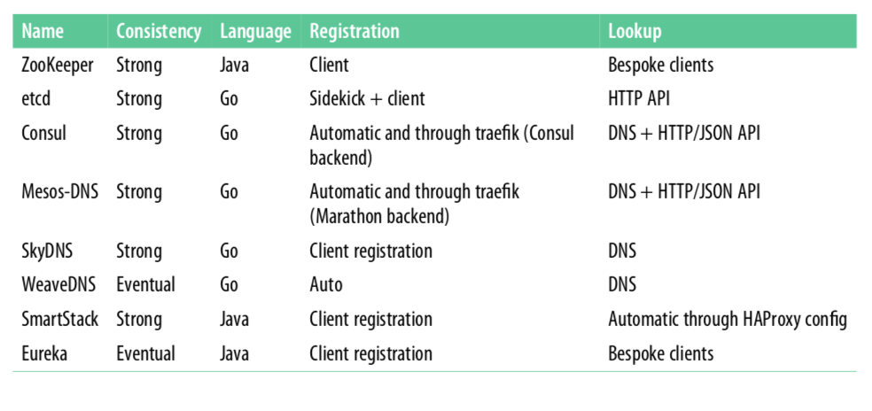

# 5.4 本章小结

&emsp;&emsp;为了结束本章，我已经整理了一张表格，概述了我们讨论过的服务发现解决方案。各种方案的最好选择取决于你的用例和要求。所以，把下面的表格作为一个快速的方向和总结。（另外，请注意，在Kubernetes的背景下，它是内置于系统中的）：

*由于容器领域的服务发现还处于快速成长的阶段，因此建议您不断重新评估您初始的选择，至少在服务发现的解决方案有巨大变化的时候*

&emsp;&emsp;在本章中，您了解了服务发现以及负载均衡。我们下章将开始讨论Kubernetes的相关内容，事实上的容器编排系统带有内置的服务发现功能（因此您不必担心本章中讨论的主题），并且有其独特的跨主机容器网络解决方案。