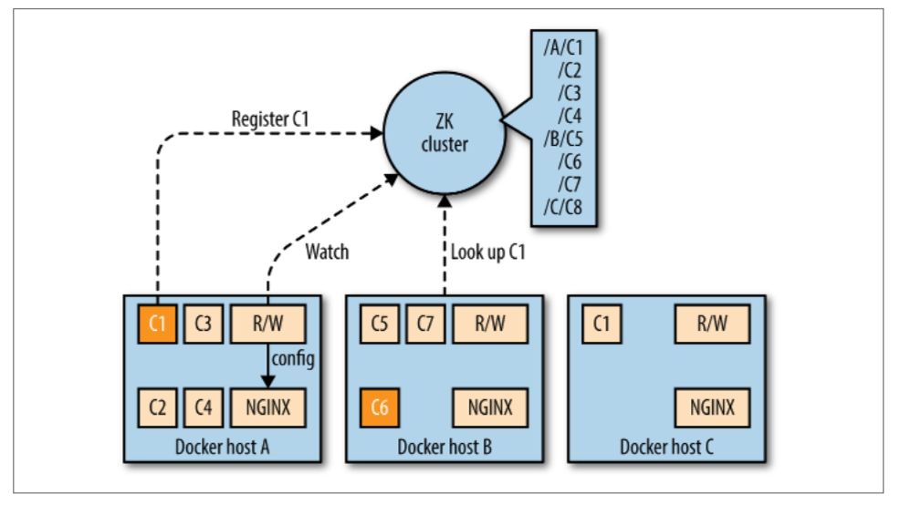
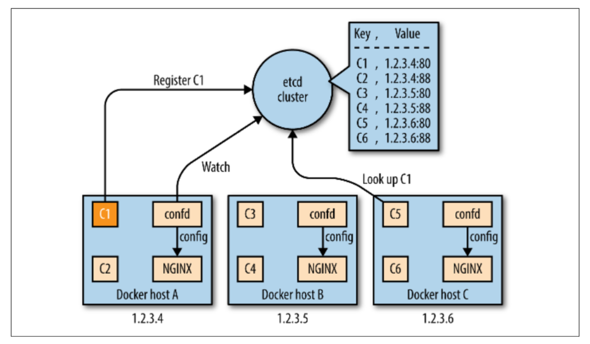

# 5.2 技术

&emsp;&emsp;本节简要介绍各种服务发现技术，列出优点和缺点，并指出在互联网上对此的进一步讨论。如需更深入的了解，请查阅Adrian Mouat的书籍“[Using Docker](http://shop.oreilly.com/product/0636920035671.do)”（O'Reilly）。

## ZooKeeper

&emsp;&emsp;[Apache ZooKeeper](http://zookeeper.apache.org)是一个ASF基金会的top项目和基于JVM的集中式配置管理工具，提供与Google[Chubby](https://research.google.com/archive/chubby.html)相似的功能。ZooKeeper（ZK）将它的有效载荷数据按照文件系统的形式组织在一个所谓的znodes层次结构中。在集群中，leader被[选举](http://zookeeper.apache.org/doc/current/zookeeperInternals.html#sc_leaderElection)出来，客户端可以连接到任何服务器来检索数据。 您需要ZK群集中的2n + 1个节点。常见的配置是三个,五个或七个节点。除此之外，您需求在容错/吞吐量上进行折衷考虑。

&emsp;&emsp;ZooKeeper是经过生产验证，成熟且可扩展的解决方案，但它有一些使用方面的缺陷。有些人认为ZK集群的安装和管理是不太愉快的体验。我见过的大多数ZK的问题都来自某些服务（比如Apache Storm）滥用它。他们要么将太多的数据放入znode中，要么[读取/写入比例不健康](http://thelastpickle.com/blog/2012/01/12/ZooKeeper-Reading.html)，本质上就是写得太快。如果您打算使用ZK，至少应考虑使用更高层的接口，如[Apache Curator](http://curator.apache.org)（这是一个围绕ZK进行大规模部署使用的包装库），以及Netflix的exhibitor（https://github.com/soabase/exhibitor）用于管理和监控ZK群集。

&emsp;&emsp;图5-1，您会看到两个组件：R/W（表示注册监视器，需要您自己编写代码）以及由R/W控制的HAProxy。无论何时在节点上调度容器时，它都会向ZK注册，使用/$nodeID/$containerID路径和IP地址作为其有效载荷数据的znode。R/W负责watch在这些znode上发生的变化并相应地配置HAProxy。

## etcd

&emsp;&emsp;[etcd](https://github.com/coreos/etcd)是CoreOS公司的一个产品, 它用Go语言编写。它是一个轻量级的分布式键值存储系统，它使用[Raft](https://raft.github.io)算法达成共识（leader–follower模型，leader选举）并使用复制日志方式将leader收到的信息分发给其follower。从某种意义上说，etcd在概念上与ZK很相似。虽然有效载荷数据可以是任意的，但etcd的HTTP API是基于JSON的，和ZK一样，您可以watch etcd中value的更改。etcd的一个非常有用的功能就是key上的TTL，这是服务发现的一个很好的构建块。与ZK相同，出于相同的原因，您需要在一个etcd群集中使用2n + 1个节点。

&emsp;&emsp;etcd的安全模型提供了TLS/SSL进行线上加密，客户端和集群之间以及etcd节点之间的客户端证书验证。

&emsp;&emsp;在图5-2中，您可以看到etcd服务发现设置与ZK的设置非常相似。主要区别在于使用confd配置HAProxy，而不是编写自己的脚本。

## Consul

&emsp;&emsp;[Consul](https://www.consul.io)使用Go语言编写，它由HashiCorp所研发。Consul提供了服务注册，服务发现和健康检查等功能。可以使用HTTP API或通过DNS查询服务。Consul支持多数据中心部署。

&emsp;&emsp;Consul的一个特点就是分布式键值存储，类似于etcd。它也使用了Raft一致性算法（对于2n + 1节点，同样适用于ZK和etcd），但是部署是不同的。Consul具有代理的概念，可以以两种可用模式之一运行：1.作为服务器（提供键值存储和DNS），2.作为客户端（注册服务和运行健康检查）。节点的服务发现由[Serf](https://www.serf.io)实现。

&emsp;&emsp;通过Consul，您基本上有四种选择来实现服务发现（从最理想到最不理想的顺序）：

1. 使用[服务定义配置文件](https://www.consul.io/intro/getting-started/services.html)，它由Consul的代理进行解释。

1. 使用具有Consul后端的工具，如[traefik](https://github.com/EmileVauge/traefik/blob/master/docs/index.md#consul)。

1. 编写你自己的sidekick进程，通过[HTTP API](https://www.consul.io/api/index.html)注册服务。

1. 利用HTTP API将服务注册服务内部中。

&emsp;&emsp;想要了解有关使用Consul进行服务发现的更多信息？可以查看Jeff Lindsay的文章“[Consul服务发现与Docker](http://progrium.com/blog/2014/08/20/consul-service-discovery-with-docker/)”和Joseph Miller的文章“[Docker DNS & Service Discovery with Consul and Registrator](http://artplustech.com/docker-consul-dns-registrator/)”。

## 完全基于DNS的解决方案

&emsp;&emsp;数十年来，DNS一直是互联网不可缺少的一部分。DNS系统的最终一致性，某些客户积极缓存DNS查找的事实，以及对SRV记录的依赖，使您可以考虑使用DNS进行服务发现。

&emsp;&emsp;我标题为“完全基于DNS的解决方案”，因为Consul技术上也有一个DNS服务器，但它只是您如何使用它来进行服务发现的一种选择。以下是一些流行且广泛使用的基于DNS的服务发现解决方案：

- Mesos-DNS

    &emsp;&emsp;[Mesos-DNS](http://mesosphere.github.io/mesos-dns/)专用于Apache Mesos中的服务发现。Go开发而成，Mesos-DNS为任何正在运行的任务轮询活动的Mesos主进程，并通过DNS以及HTTP API公开`<ip>:<port>`信息。对于其他主机名或服务的DNS请求，Mesos-DNS可以使用外部nameserver，也可以利用现有的DNS服务器仅将Mesos任务的请求转发给Mesos-DNS。

- SkyDNS

    &emsp;&emsp;使用etcd，您可以向[SkyDNS](https://github.com/skynetservices/skydns)发布您的服务，SkyDNS将服务定义存储到etcd中并更新其DNS记录。您的客户端应用程序发出DNS查询以发现服务。因此，在功能方面，它与Consul很相似，没有健康检查。

- WeaveDNS

    &emsp;&emsp;在Weave 0.9中引入了[WeaveDNS](https://www.weave.works/docs/net/latest/tasks/weavedns/weavedns/)，作为在Weave网络上服务发现的简单解决方案，允许容器通过主机名查找其他容器的IP地址。在Weave 1.1中，引入了一种所谓的[Gossip DNS](https://www.weave.works/blog/weave-gossip-dns/)协议，通过缓存提高了查找速度，并且包含了超时功能。在新的实现中，注册被广播给所有参与的实例，随后将所有条目保存在内存中，后续的请求就可以在本地进行处理查找。

## Airbnb的SmartStack和Netflix的Eureka

&emsp;&emsp;在本节中，我们将看看两个定制系统，这些系统是为满足特定需求而开发的。这并不意味着你不能或不应该使用它们，您可以从中借鉴一些经验。

&emsp;&emsp;Airbnb的[SmartStack](https://github.com/airbnb/smartstack-cookbook)是一个自动化的服务发现和注册框架，透明地处理创建，删除，失败和维护工作。SmartStack使用与您的容器在同一主机上运行的两个独立服务：Nerve（写入ZK）进行服务注册，Synapse（动态配置HAProxy）进行查找。对于非容器环境来说，这是一个行之有效的解决方案，对Docker环境是否有用，还需要时间检验。

&emsp;&emsp;Netflix的[Eureka](https://github.com/Netflix/eureka)不同，主要是因为它诞生于AWS环境（所有Netflix的服务跑着AWS上）。Eureka是一种基于REST的服务，用于定位服务以实现中间层服务器的负载平衡和故障转移，并且还提供了一个基于Java的客户端组件，该组件与服务进行直接交互。这个客户端有一个内置的负载均衡器，可以进行基本的round-robin负载均衡。在Netflix中，Eureka被用于红/黑部署，Cassandra和memcached部署，以及携带有关服务的应用程序特定的元数据。

&emsp;&emsp;Eureka集群中的参与节点异步地在彼此之间复制其服务注册表。 与ZK，etcd或Consul相比，Eureka倾向于服务可用性的强一致性; 它留给客户来处理陈旧的读，但在网络分区的情况下具有更强的适应性。 而且，你知道，[网络是可靠的](https://queue.acm.org/detail.cfm?id=2655736)。